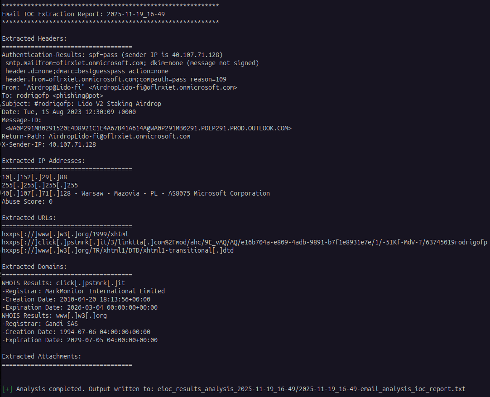
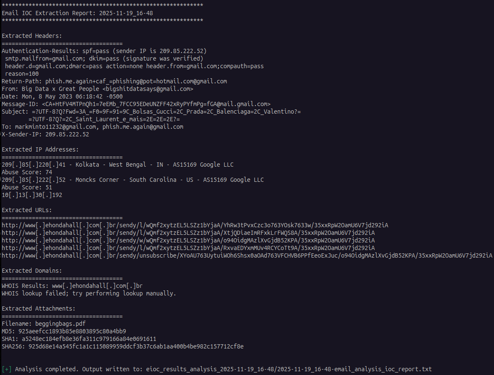

# Email IOC Extraction

Script designed to aid email forensic analysis by extracting various artefacts from email `.eml` files - IP addresses, URLs, Domains, and attachments. 
Based on MalwareCube's Email IOC Extractor - https://github.com/MalwareCube/Email-IOC-Extractor/tree/main

Version 1.2

## Features
MalwareCube's Email IOC included the following features:
+ **IP Address Extraction**
+ **URL Extraction**
+ **Header Extraction**
+ **Attachment Extration**
+ **IP and URL Defanging**
+ **IP Information Lookup (ipinfo.io)**

_Features added to this Python Script_:
+ **Error Handling** - Errors are logged (error.log) to assist with troubleshooting.
+ **IOC Extraction Output to File** - In addition to displaying the IOCs on the terminal/screen, the script will save the same output to a file for future reference.
+ **AbuseIPDB API Support** - Basic threat intelligence integration for IP reputation check (see Usage section below).
+ **Root Domain Extraction and WHOIS** - Root Domain WHOIS Age and Registrar checking (does not include email domain checks; these still need to be done manually).
+ **Report Folder** - Creates a folder to store the IOC report and error.log file.

## Requirements
The `requirements.txt` file defines all the Python 3.x packages needed to run the `email_ioc.py` script.
```bash
pip3 install -r requirements.txt
```
## Disclaimer
This script is intended for analysis and research purposes only. Usage should comply with applicable laws and regulations.

## Usage
The `email_ioc.py` script takes two parameters - the first is the email.eml file, and the second (optional) parameter is the AbuseIPDB API key.

You will need to register on the [AbuseIPDB](https://www.abuseipdb.com/) website to create your own API key. The main advantage of providing the AbuseIPDB API key is the inclusion of an Abuse Score for any IP discovered.

It is still recommended that you manually use additional resources to verify the domains, IPs, and URLs extracted by this script. 
```bash
python3 email_ioc.py <~/path/suspected-email-file.eml> [abuseipdb-api-key]
```



## Contributions
Contributions, bug reports, and feature requests are welcome. Feel free to open an issue or submit a pull request on GitHub.

## Acknowlegdements
+ [MalwareCubee](https://malwarecube.com/)
+ [ipinfo.io](https://ipinfo.io/)
+ [AbuseIPDB](https://www.abuseipdb.com/)
