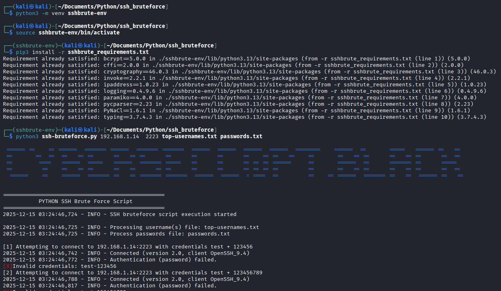
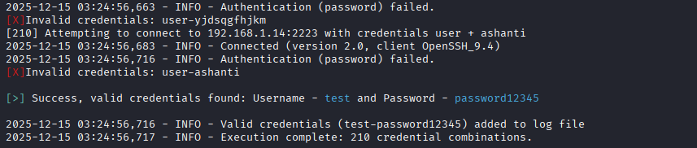

# Python SSH Credential Brute Force Script


```
 ====== ==    == ======  ======= ======  ======= =======  ======  ======  ======  ======  ========    ======  ==       =====   ====== ==   == 
==       ==  ==  ==   == ==      ==   == ==      ==      ==      ==      ==    == ==   ==    ==       ==   == ==      ==   == ==      ==  ==  
==        ====   ======  =====   ======  ======= =====   ==      ==      == == == ======     ==       ======  ==      ======= ==      =====   
==         ==    ==   == ==      ==   ==      == ==      ==      ==      == == == ==         ==       ==   == ==      ==   == ==      ==  ==  
 ======    ==    ======  ======= ==   == ======= =======  ======  ======  = ====  ==         ==    == ======  ======= ==   ==  ====== ==   ==                                                                                                  
```
                                                                                                                                                                                                                                                                                      

The script below is an improvement on [David Bombal's Python script](https://github.com/davidbombal/ssh_bruteforcing/blob/main/main.py) with the following added features:
+ Submit a plaintext username file list,
+ Submit a plaintext password file list,
+ Closes SSH connections after each attempt to help with rate limiting on the server, and
+ Logging (console and to a file - ssh_bruteforce.log, for future reference and debugging).

I removed threading for this version of the script and opted to use file streaming to allow it to handle large files (~ files with 100K rows of entries) instead of loading the entire file into RAM for processing.

## Usage
Execute the following commands at the terminal:
+ `python -m venv sshbrute_env`
+ `source sshbrute_env/bin/activate`
+ `pip3 install -r sshbrute_requirements.txt`

The above will set up the required Python virtual environment, after which, execute the following (substituting the appropriate variables):
+ `python3 ssh-bruteforce.py [host-ipv4] [host-port] [path/to/username_file.txt] [path/to/password.txt]

## Screenshots


